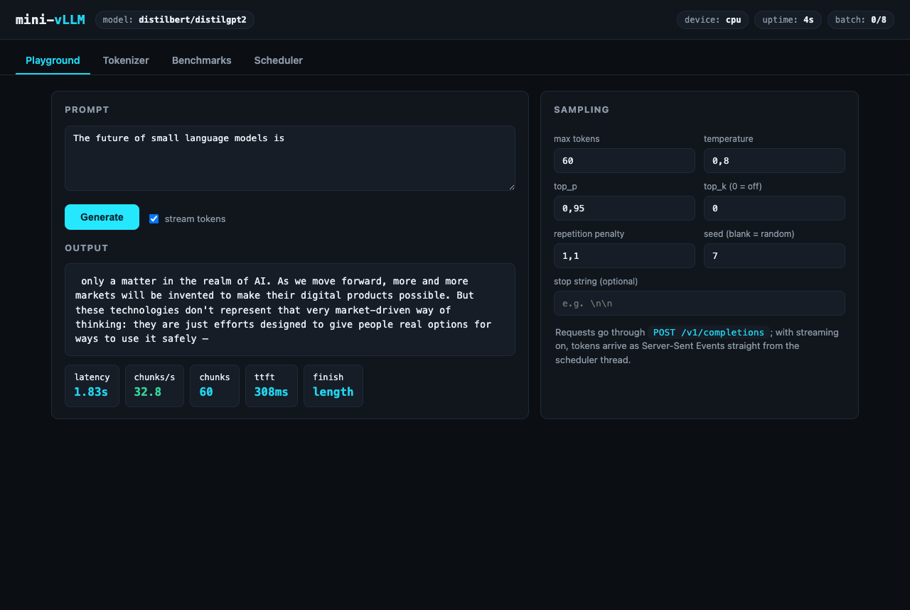
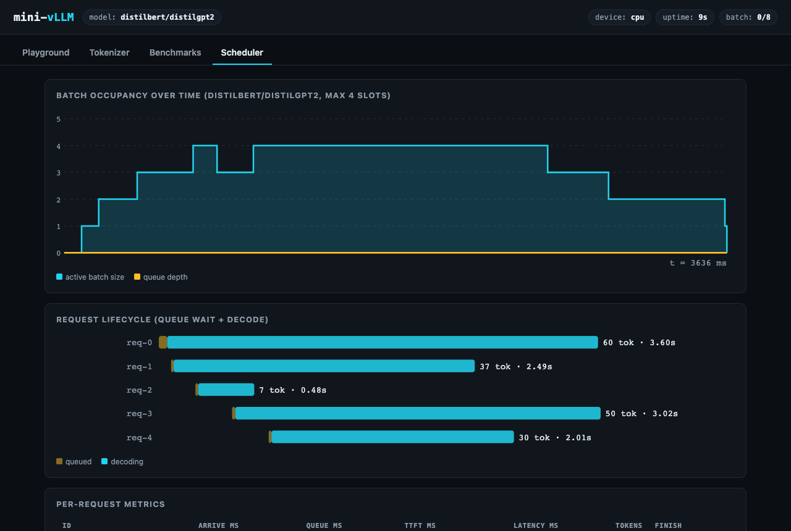
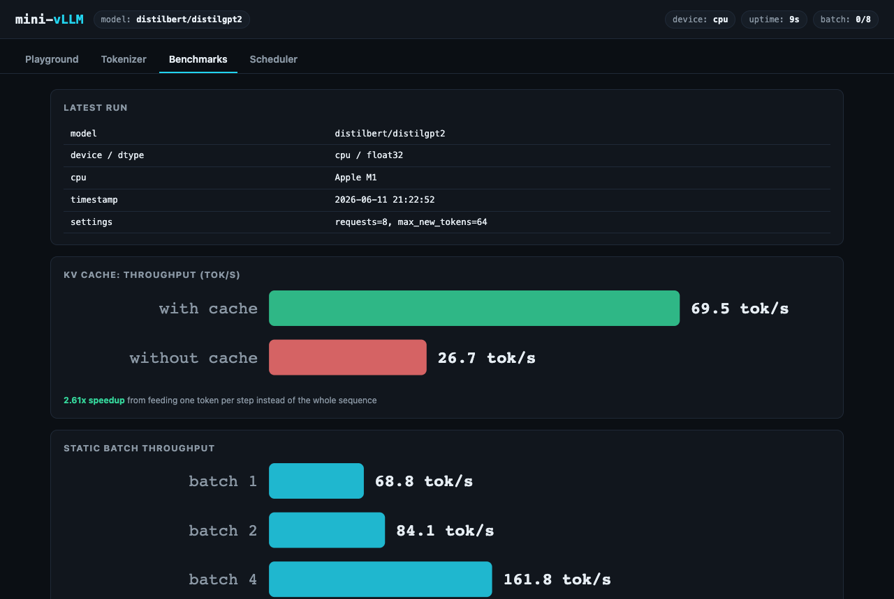
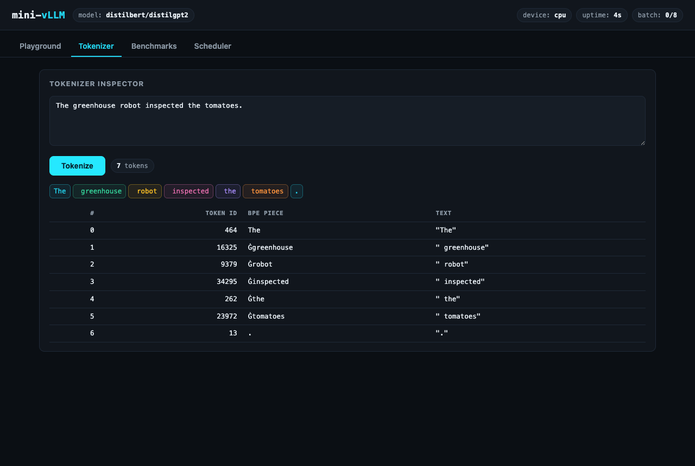
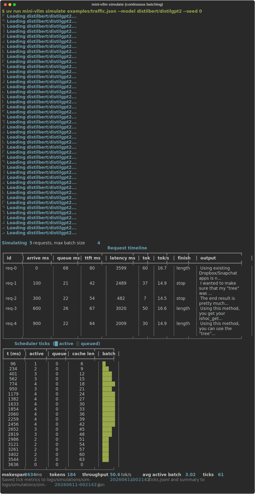
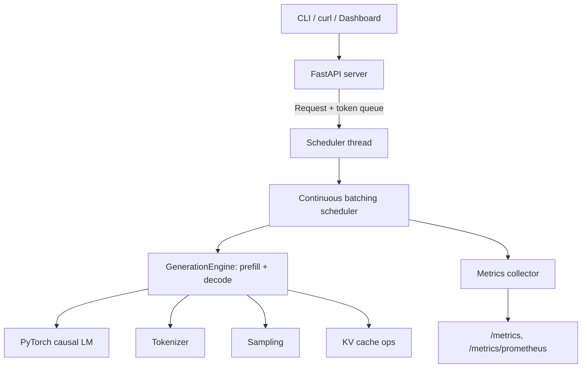

# mini-vLLM

**A minimal educational LLM inference engine: custom decoding loop, KV cache, continuous batching, streaming, and an OpenAI-compatible API.**


[](https://github.com/Mihawii/mini-vllm/actions/workflows/ci.yml)


mini-vLLM is a from-scratch inference server built to understand how systems
like vLLM, TGI, and llama.cpp actually work. Hugging Face supplies weights
and tokenizers; everything after that is implemented here and kept readable:
prefill and decode phases, KV cache management, batched sampling, an
iteration-level scheduler, Server-Sent Events streaming, metrics, and a
benchmark suite that measures real numbers on your machine.

The main decoding path never calls `model.generate()`. A test suite holds
the engine to that standard: our greedy output must match the Hugging Face
reference token for token, with and without the cache, batched and unbatched.

Built CPU-first. Everything below runs on a laptop; CUDA is used
automatically when present, and [docs/gpu.md](docs/gpu.md) is a turnkey
runbook for rerunning the benchmarks on a rented GPU.

The long-form story of building it, including the two best bugs, is in
[the write-up](docs/writeup-kv-cache-and-continuous-batching.md).

## Screenshots

### Playground (live SSE streaming)


### Continuous batching scheduler


### KV cache benchmark


### Tokenizer inspector


### CLI


More captures (model inspection, generation, benchmark report) live in
[docs/assets/](docs/assets/), and [docs/screenshots.md](docs/screenshots.md)
explains how to regenerate all of them.

## Features

- Custom autoregressive decoding loop with explicit prefill and decode phases
- KV cache with on/off toggle and a benchmark that proves the speedup
- Paged KV cache backend: block pool, per-request block tables, lazy shape discovery (GQA models included), live utilization metrics
- Preemption: when the pool fills, the newest request is evicted and recomputed later with zero output loss
- Prefix caching: content-addressed blocks (chained hashes, ref-counts, LRU eviction) let shared prompt prefixes skip prefill entirely
- Speculative decoding: a draft model proposes, the target verifies in one forward pass, and a lossless acceptance rule keeps the output provably identical to target-only decoding
- Chunked prefill: long prompts stop stalling the decode batch
- Sampling: temperature, top-k, top-p, repetition penalty, stop strings, seeded reproducibility, greedy at temperature 0
- Static batching with left padding and per-row finish tracking
- Continuous batching: an iteration-level scheduler where requests join and leave the live batch mid-flight
- SSE streaming from the CLI, the API, and the dashboard
- OpenAI-style HTTP API (`/v1/completions`, `/v1/chat/completions`) with usage and timing extras
- Dynamic int8 quantization experiment with measured size, speed, and output-agreement numbers
- Tensor parallelism math demo: one block sharded Megatron-style across two simulated ranks, asserted equal to the reference
- Metrics: JSON and Prometheus endpoints, request log, `mini-vllm stats`
- Benchmark suite with JSON/CSV output and a Markdown report generator
- Static dashboard (no build step): playground, tokenizer inspector, benchmark charts, scheduler timeline with pool view
- Tests on a 100K-parameter model; the suite runs in well under a minute

## Architecture



One thread owns the model. HTTP handlers submit requests through queues and
read tokens back the same way, so concurrent API calls land in one batched
decode step instead of waiting in line. The design is documented in
[docs/architecture.md](docs/architecture.md).

## Quick start

```bash
git clone https://github.com/Mihawii/mini-vllm.git
cd mini-vllm
uv sync

# look at a model
uv run mini-vllm inspect --model sshleifer/tiny-gpt2

# generate text (distilgpt2 downloads on first use, ~350 MB)
uv run mini-vllm generate "An inference engine is" --stream --max-new-tokens 60

# feel the KV cache
uv run mini-vllm generate "Write a haiku about GPUs" -n 80 --no-kv-cache
uv run mini-vllm generate "Write a haiku about GPUs" -n 80 --kv-cache

# watch continuous batching happen
uv run mini-vllm simulate examples/traffic.json --model distilbert/distilgpt2

# serve the API + dashboard
uv run mini-vllm serve --model distilbert/distilgpt2

# chat that actually chats (~1 GB download, instruct model with a real template)
uv run mini-vllm serve --model Qwen/Qwen2.5-0.5B-Instruct
```

Without uv: `python -m venv .venv && source .venv/bin/activate && pip install -e .`
then call `mini-vllm` directly. Docker: `docker build -t mini-vllm . && docker run -p 8000:8000 mini-vllm`.

With the server running: [dashboard](http://127.0.0.1:8000/dashboard) ·
[API docs](http://127.0.0.1:8000/docs) · [metrics](http://127.0.0.1:8000/metrics) ·
[health](http://127.0.0.1:8000/health)

## API

```bash
curl http://127.0.0.1:8000/v1/completions \
  -H "Content-Type: application/json" \
  -d '{
    "prompt": "Mini-vLLM is",
    "max_tokens": 80,
    "temperature": 0.7,
    "top_p": 0.9,
    "seed": 42
  }'
```

Responses follow the OpenAI shape plus a `mini_vllm` block with latency,
time to first token, queue wait, and tokens/sec. Set `"stream": true` for
SSE chunks. Full reference, including what is and is not OpenAI compatible:
[docs/api.md](docs/api.md).

## Benchmarks

Measured with `mini-vllm bench` on an Apple M1 (CPU, float32, distilgpt2,
64 new tokens per request). Every number is from a committed run in
[benchmarks/results/](benchmarks/results/); rerun the command to reproduce
on your hardware.

### Three baselines, same prompts, greedy

| Baseline | avg latency | tok/s per request | aggregate throughput |
|---|---|---|---|
| Hugging Face `model.generate()` | 1.03 s | 62.0 | 62.0 |
| mini-vLLM, no KV cache | 2.36 s | 27.1 | 27.1 |
| mini-vLLM, KV cache | **0.96 s** | **66.8** | 66.8 |
| mini-vLLM, scheduler batched x4 | 2.84 s | 22.5 | **134.3** |

The custom loop with the cache edges out `model.generate()` on the same
work, and continuous batching doubles aggregate throughput at the cost of
per-request latency when everything arrives at once. TTFT for the cached
single path is ~22 ms.

### Feature measurements

| Scenario | Result |
|---|---|
| KV cache on vs off | 69.5 vs 26.7 tok/s, **2.6x speedup** |
| Static batching | 69 tok/s at batch 1 to 298 tok/s at batch 8 |
| Continuous batching (4 slots vs 1) | 68 to 140 tok/s, **2.1x throughput** |
| Prefill scaling | ~24 ms at 16 prompt tokens to ~100 ms at 256, decode speed flat |
| Dynamic int8 vs fp32 | 72 vs 64 tok/s, checkpoint 328 to 239 MB, 100% greedy token agreement on the test prompts |
| Speculative (gpt2 target, distilgpt2 draft, gamma 4) | 0.75x on CPU at 59% acceptance; 3.2 tokens committed per target forward, output verified identical |

Speculative decoding loses wall-clock time on this CPU because the draft
costs about two thirds of the target per step; the benchmark says so
plainly. The target forward count still drops 3x, which is the quantity
that turns into speedup once the draft/target cost ratio grows (bigger
targets, or a GPU; see [docs/gpu.md](docs/gpu.md)).

The KV cache gap widens with completion length because the uncached path
re-processes the whole sequence every step. The prompt sweep shows the other
side of the same coin: prefill cost grows with prompt size while cached
decode speed barely moves.

## How it works

**KV cache.** Each transformer layer stores the keys and values of every
processed position. Decode steps then feed only the newest token; attention
reads the history from the cache instead of recomputing it, turning O(T^2)
generation work into O(T). The full walkthrough, including why position ids
need explicit handling, is in [docs/kv_cache.md](docs/kv_cache.md).

**Continuous batching.** Static batches waste slots: a finished request
holds its place until the whole batch drains. The scheduler here rebuilds
the batch every model step instead. New requests get prefilled and their
caches are left-padded and merged into the live batch; finished requests
leave immediately. `mini-vllm simulate` makes the whole lifecycle visible,
and [docs/batching.md](docs/batching.md) covers the mechanics, including why
zero-padded cache columns are safe under an attention mask.

**Paged KV cache.** Cache memory comes from a pool of fixed-size blocks;
each request holds a block table instead of one growing tensor. Appends are
O(1), fragmentation cannot happen by construction, and freed blocks are
reusable immediately, which is what makes preemption cheap. Try it:

```bash
uv run mini-vllm simulate examples/traffic.json \
    --cache-backend paged --block-size 16 --pool-blocks 48 --prefill-chunk-size 32
```

[docs/paged_kv_cache.md](docs/paged_kv_cache.md) explains the design and is
candid about the one piece that is not vLLM-grade: stock Hugging Face
models need contiguous tensors, so blocks are gathered per step instead of
being read in place by a custom kernel.

## Project structure

```
src/mini_vllm/
  engine/        model_loader, tokenizer, sampling, kv_cache, batching,
                 cache_backend (contiguous + paged pool), quantize,
                 generation (the decode loop), scheduler (continuous
                 batching, chunked prefill, preemption)
  server/        FastAPI app, OpenAI-style schemas, SSE streaming bridge
  metrics/       collector (counters, percentiles), JSONL storage
  benchmark/     measured scenarios, report generator
  dashboard/     static HTML/JS/CSS, no build step
  cli.py         inspect, tokenize, generate, batch, simulate, serve,
                 stats, bench, bench-report
experiments/     tensor_parallel.py (sharding math demo)
tests/           pytest suite against sshleifer/tiny-gpt2
docs/            architecture, kv_cache, paged_kv_cache, batching, api
examples/        prompts.json, traffic.json
benchmarks/      methodology + committed results
```

## Testing

```bash
uv run pytest
```

The suite uses a 100K-parameter model so 74 tests finish in well under half
a minute. The tests that matter most are correctness anchors: greedy parity
between our loop and `model.generate()`, parity with the cache on and off,
parity between the paged and contiguous backends, batched rows matching
single-request output, preempted requests finishing with exactly their
unpreempted output, and chunked prefill leaving results unchanged while
decode keeps advancing beside it.

## Limitations

This is a teaching system, sized to be read in an afternoon. Honest gaps:

- The paged backend gathers blocks into contiguous tensors each step because
  stock Hugging Face models require that layout; vLLM's kernels read blocks
  in place. Memory management is real, the attention kernel is not ours.
- The scheduler is FCFS with recompute-mode preemption; there are no
  priority classes and no prefill/decode disaggregation across processes.
- Tensor parallelism is a numerical demo on simulated ranks
  (`experiments/tensor_parallel.py`), never a multi-device serving feature
  here. One model per server process.
- Dynamic int8 quantization needs a torch build with a quantized engine
  (qnnpack or fbgemm); the experiment reports and degrades when absent.
- OpenAI compatibility covers the common fields; `n>1`, `logprobs`, and tool
  calls are not implemented.
- GPT-2 family models are not instruction-tuned; for a chat endpoint that
  actually chats, serve a small instruct model such as
  Qwen2.5-0.5B-Instruct (the engine is model-agnostic and handles its chat
  template and GQA cache layout).

One field note worth reading: safetensors memory-maps weights at arbitrary
file offsets, and on macOS 26 Apple's Accelerate `sgemv` kernel crashes the
process on unaligned float32 reads. The loader clones parameters to force
aligned allocations; the investigation is written up in
[docs/architecture.md](docs/architecture.md#field-note-the-macos-accelerate-alignment-crash).

## Roadmap

- Triton paged-attention kernel on a rented GPU: read blocks in place
  through the block table instead of gathering (runbook ready in
  [docs/gpu.md](docs/gpu.md))
- GPU benchmark rows next to every CPU number
- Mixed prefill+decode forward passes (true chunked prefill batching needs
  variable-length attention)
- Real multi-process tensor parallelism behind the existing sharding math
- WebSocket streaming as an SSE alternative

## License

MIT. Model weights come from their respective repositories on the Hugging
Face Hub under their own licenses.
