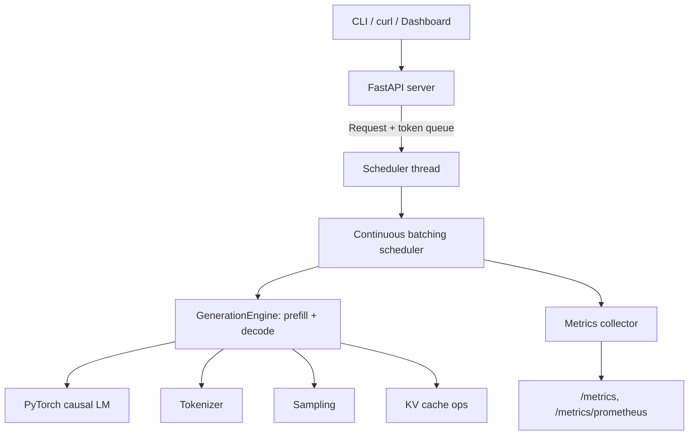

# mini-vLLM

**A minimal educational LLM inference engine: custom decoding loop, KV cache, continuous batching, streaming, and an OpenAI-compatible API.**


mini-vLLM is a from-scratch inference server built to understand how systems
like vLLM, TGI, and llama.cpp actually work. Hugging Face supplies weights
and tokenizers; everything after that is implemented here and kept readable:
prefill and decode phases, KV cache management, batched sampling, an
iteration-level scheduler, Server-Sent Events streaming, metrics, and a
benchmark suite that measures real numbers on your machine.

The main decoding path never calls `model.generate()`. A test suite holds
the engine to that standard: our greedy output must match the Hugging Face
reference token for token, with and without the cache, batched and unbatched.

Built CPU-first. Everything below runs on a laptop; CUDA is used
automatically when present.

## Screenshots

### Playground (live SSE streaming)


### Continuous batching scheduler


### KV cache benchmark


### Tokenizer inspector


### CLI


More captures (model inspection, generation, benchmark report) live in
[docs/assets/](docs/assets/), and [docs/screenshots.md](docs/screenshots.md)
explains how to regenerate all of them.

## Features

- Custom autoregressive decoding loop with explicit prefill and decode phases
- KV cache with on/off toggle and a benchmark that proves the speedup
- Sampling: temperature, top-k, top-p, repetition penalty, stop strings, seeded reproducibility, greedy at temperature 0
- Static batching with left padding and per-row finish tracking
- Continuous batching: an iteration-level scheduler where requests join and leave the live batch mid-flight, with KV cache merge on admission
- SSE streaming from the CLI, the API, and the dashboard
- OpenAI-style HTTP API (`/v1/completions`, `/v1/chat/completions`) with usage and timing extras
- Metrics: JSON and Prometheus endpoints, request log, `mini-vllm stats`
- Benchmark suite with JSON/CSV output and a Markdown report generator
- Static dashboard (no build step): playground, tokenizer inspector, benchmark charts, scheduler timeline
- 59 tests on a 100K-parameter model; the suite runs in about 10 seconds

## Architecture



One thread owns the model. HTTP handlers submit requests through queues and
read tokens back the same way, so concurrent API calls land in one batched
decode step instead of waiting in line. The design is documented in
[docs/architecture.md](docs/architecture.md).

## Quick start

```bash
git clone https://github.com/<you>/mini-vllm.git
cd mini-vllm
uv sync

# look at a model
uv run mini-vllm inspect --model sshleifer/tiny-gpt2

# generate text (distilgpt2 downloads on first use, ~350 MB)
uv run mini-vllm generate "An inference engine is" --stream --max-new-tokens 60

# feel the KV cache
uv run mini-vllm generate "Write a haiku about GPUs" -n 80 --no-kv-cache
uv run mini-vllm generate "Write a haiku about GPUs" -n 80 --kv-cache

# watch continuous batching happen
uv run mini-vllm simulate examples/traffic.json --model distilbert/distilgpt2

# serve the API + dashboard
uv run mini-vllm serve --model distilbert/distilgpt2
```

Without uv: `python -m venv .venv && source .venv/bin/activate && pip install -e .`
then call `mini-vllm` directly. Docker: `docker build -t mini-vllm . && docker run -p 8000:8000 mini-vllm`.

With the server running: [dashboard](http://127.0.0.1:8000/dashboard) ·
[API docs](http://127.0.0.1:8000/docs) · [metrics](http://127.0.0.1:8000/metrics) ·
[health](http://127.0.0.1:8000/health)

## API

```bash
curl http://127.0.0.1:8000/v1/completions \
  -H "Content-Type: application/json" \
  -d '{
    "prompt": "Mini-vLLM is",
    "max_tokens": 80,
    "temperature": 0.7,
    "top_p": 0.9,
    "seed": 42
  }'
```

Responses follow the OpenAI shape plus a `mini_vllm` block with latency,
time to first token, queue wait, and tokens/sec. Set `"stream": true` for
SSE chunks. Full reference, including what is and is not OpenAI compatible:
[docs/api.md](docs/api.md).

## Benchmarks

Measured with `mini-vllm bench` on an Apple M1 (CPU, float32, distilgpt2,
64 new tokens per request). Every number is from a committed run in
[benchmarks/results/](benchmarks/results/); rerun the command to reproduce
on your hardware.

| Scenario | Result |
|---|---|
| Single request | 0.93 s avg latency, 69 tok/s |
| KV cache on vs off | 69.3 vs 25.8 tok/s, **2.69x speedup** |
| Static batching | 69 tok/s at batch 1 to 301 tok/s at batch 8 |
| Continuous batching (4 slots vs 1) | 66 to 152 tok/s, **2.3x throughput** |
| Prefill scaling | 24 ms at 16 prompt tokens to 100 ms at 256, decode speed flat |

The KV cache gap widens with completion length because the uncached path
re-processes the whole sequence every step. The prompt sweep shows the other
side of the same coin: prefill cost grows with prompt size while cached
decode speed barely moves.

## How it works

**KV cache.** Each transformer layer stores the keys and values of every
processed position. Decode steps then feed only the newest token; attention
reads the history from the cache instead of recomputing it, turning O(T^2)
generation work into O(T). The full walkthrough, including why position ids
need explicit handling, is in [docs/kv_cache.md](docs/kv_cache.md).

**Continuous batching.** Static batches waste slots: a finished request
holds its place until the whole batch drains. The scheduler here rebuilds
the batch every model step instead. New requests get prefilled and their
caches are left-padded and merged into the live batch; finished requests
leave immediately. `mini-vllm simulate` makes the whole lifecycle visible,
and [docs/batching.md](docs/batching.md) covers the mechanics, including why
zero-padded cache columns are safe under an attention mask.

## Project structure

```
src/mini_vllm/
  engine/        model_loader, tokenizer, sampling, kv_cache, batching,
                 generation (the decode loop), scheduler (continuous batching)
  server/        FastAPI app, OpenAI-style schemas, SSE streaming bridge
  metrics/       collector (counters, percentiles), JSONL storage
  benchmark/     measured scenarios, report generator
  dashboard/     static HTML/JS/CSS, no build step
  cli.py         inspect, tokenize, generate, batch, simulate, serve,
                 stats, bench, bench-report
tests/           59 tests against sshleifer/tiny-gpt2
docs/            architecture, kv_cache, batching, api, demo script
examples/        prompts.json, traffic.json
benchmarks/      methodology + committed results
```

## Testing

```bash
uv run pytest
```

The suite uses a 100K-parameter model so it stays fast (~10 s). The tests
that matter most are correctness anchors: greedy parity between our loop and
`model.generate()`, parity with the cache on and off, batched rows matching
single-request output, and the scheduler completing interleaved workloads
with streaming deltas that concatenate to the final text.

## Limitations

This is a teaching system, sized to be read in an afternoon. Honest gaps:

- No paged KV cache: each batch keeps one contiguous cache tensor, re-padded
  as requests join and leave. vLLM's block tables avoid those copies.
- Prefill runs inline on the model thread, so one huge prompt briefly stalls
  decoding for everyone (visible in the simulate timeline).
- No preemption, priorities, or prefill/decode disaggregation.
- One model per server process; no tensor parallelism, no quantization.
- OpenAI compatibility covers the common fields; `n>1`, `logprobs`, and tool
  calls are not implemented.
- Base GPT-2 models are not instruction-tuned, so chat output quality
  reflects the base model, and the chat endpoint mainly demonstrates
  template plumbing.

One field note worth reading: safetensors memory-maps weights at arbitrary
file offsets, and on macOS 26 Apple's Accelerate `sgemv` kernel crashes the
process on unaligned float32 reads. The loader clones parameters to force
aligned allocations; the investigation is written up in
[docs/architecture.md](docs/architecture.md#field-note-the-macos-accelerate-alignment-crash).

## Roadmap

- Paged KV cache with a block table and a memory-usage view in the dashboard
- Prefill chunking so large prompts stop stalling the decode loop
- Speculative decoding (tiny-gpt2 drafting for distilgpt2)
- Dynamic int8 quantization experiment with a quality/latency comparison
- TinyLlama support notes for machines with more disk and RAM
- WebSocket streaming as an SSE alternative

## License

MIT. Model weights come from their respective repositories on the Hugging
Face Hub under their own licenses.
