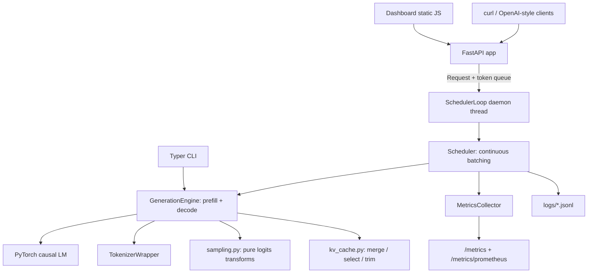

# Architecture

## System overview

## Module map

| Module | Responsibility |
|---|---|
| `engine/model_loader.py` | Load weights + tokenizer, resolve device and dtype, report metadata |
| `engine/tokenizer.py` | Encode, decode, token breakdown, left padding policy |
| `engine/sampling.py` | SamplingParams validation; temperature, top-k, top-p, repetition penalty, seeded draws |
| `engine/kv_cache.py` | Cache layout, Hugging Face Cache object normalization, batch merge and row ops |
| `engine/cache_backend.py` | Per-request cache storage: contiguous tensors or the paged block pool |
| `engine/batching.py` | Left-pad collation, position ids from attention masks |
| `engine/generation.py` | The decode loop: prefill, cached decode, stop handling, static batching, HF fallback |
| `engine/scheduler.py` | Iteration-level scheduling, chunked prefill, preemption, daemon loop for the server |
| `engine/quantize.py` | Dynamic int8 experiment: Conv1D conversion plus torch dynamic quantization |
| `server/` | FastAPI app, OpenAI-style schemas, SSE streaming bridge, routes |
| `metrics/` | Thread-safe counters and percentiles; JSONL persistence |
| `benchmark/` | Measured scenarios, JSON/CSV writers, Markdown report |
| `dashboard/static/` | Vanilla JS dashboard (Playground, Tokenizer, Benchmarks, Scheduler) |

## Request lifecycle (HTTP path)

1. FastAPI validates the JSON body against the Pydantic schema (bad fields
   stop here with a 422).
2. The handler builds `SamplingParams` and a `Request` carrying a
   thread-safe output queue, then calls `SchedulerLoop.submit()`.
3. `Scheduler.submit()` runs on the caller's thread: it encodes the prompt
   and rejects oversized or empty prompts immediately (the queue receives an
   error and the handler returns 400).
4. The scheduler thread admits the request on its next tick and prefills it
   (in one pass, or chunk by chunk when chunked prefill is on); its KV cache
   lands in the configured backend and joins the per-tick batch assembly.
5. Every tick appends one token per active request. Deltas go into each
   request's queue as they appear.
6. A non-streaming handler waits for the terminal `("done", result)` item
   and returns one JSON response. A streaming handler forwards each delta as
   an SSE chunk and closes with `[DONE]`.
7. The metrics collector sees submitted / started / finished events and the
   request log gets one JSONL line.

## Threading model

There is exactly one model thread. PyTorch inference is synchronous and the
GIL makes shared-state threading unrewarding, so the design keeps every
forward pass on the scheduler thread and gives each request a queue as its
only communication channel. Async handlers never touch the model; they wait
on queues via worker threads (`asyncio.to_thread`), which keeps the event
loop free to accept connections while generation runs.

Consequences worth knowing:

- Uvicorn must run a single worker. Concurrency comes from continuous
  batching inside the process, and process replication would need one model
  copy per worker.
- Each in-flight streaming response parks one default-executor thread on a
  queue read. The default pool is fine for the request rates this engine
  targets (single digits concurrent).
- A request whose prompt fails validation never reaches the model thread.

## Error handling policy

Readable errors at the boundary, fail-fast inside. Model load failures raise
`ModelLoadError` with the model id and likely causes. Prompt overflow raises
`PromptTooLongError` naming both budgets; the API maps it to 400. Invalid
sampling parameters raise `ValueError` from one place
(`SamplingParams.__post_init__`). If a scheduler step throws, every active
request gets an error message instead of a hang, and the loop keeps serving
subsequent requests.

## Field note: the macOS Accelerate alignment crash

During development, distilgpt2 (but never tiny-gpt2) crashed the process
with SIGBUS. The macOS crash report showed `EXC_ARM_DA_ALIGN` inside
Accelerate's `cblas_sgemv`, reached from torch's CPU matmul. Cause:
safetensors loads weights zero-copy via mmap, so a tensor's data address is
its byte offset inside the checkpoint file, and Accelerate's vectorized
sgemv kernel faults on certain unaligned float32 reads under macOS 26.
tiny-gpt2 escaped because its tiny shapes never took that kernel.

The fix in `model_loader._realign_parameters` clones every parameter after
loading, forcing fresh aligned allocations. It costs one pass over the
weights at startup and removed the crash entirely (fp32 went from dying to
58+ tok/s). Kept as a documented workaround because it is cheap and makes
the engine immune to checkpoint layout luck.

## Design decisions and tradeoffs

- **Legacy-tuple cache format internally.** Hugging Face's Cache classes
  have changed layout several times. Normalizing to plain tensors in one
  module (`kv_cache.py`) contains the churn and keeps the teaching surface
  simple.
- **Left padding everywhere.** One padding policy shared by single, static
  batch, and scheduler paths means one set of mask/position helpers and one
  set of invariants to test.
- **Per-row sampling in the scheduler.** Each request keeps its own
  temperature, seed, and penalty context. Sampling row by row costs little
  at batch sizes this engine targets and keeps per-request reproducibility.
- **Static dashboard.** No build step to break; the server serves files and
  JSON. The tradeoff is hand-rolled SVG charts instead of a charting
  library.
- **CPU-first.** Everything works on a laptop. CUDA is picked up
  automatically when present; MPS stays opt-in because small models lose
  more to kernel dispatch than they gain from the GPU.
